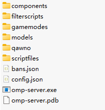

# 前言：
开发服务器所需要使用的编程语言[Pawn](https://www.compuphase.com/pawn/pawn.htm)，联机服务器的一切玩法、内容、功能都需要我们自己编写创造，这意味着开始是一片空白。
创造一个成熟的服务器需要一定的技术和编程经验，如果你愿意学习探索，一步步实现自己的想法和创意，这个过程会很有趣。
开发联机服务器的入门难度几乎为零，尽管门槛很低，但上限也很高，只有多看、多学、不断积累知识，巩固基础才能创造出成熟的脚本。
希望这个教程能起到抛砖引玉的作用，让大家了解原理和思路，尝试在没有任何编程基础的情况下快速入门，如果你想更好地学习开发，强烈建议先学习C语言基础。

# 想法、目标和心态
进行开发之前，你需要有想法和目标，你要做什么服务器，赛车？角色扮演？自由服？团队竞技？细化到每一个环节，学会使用思维导图去整理自己的玩法内容和开发思路。
同时把心态放好，接受别人的建设性意见、批评意见，不要把事情想得太复杂，给自己多一点自信心，如果你总是认为它太难了，那你永远都学不会，往往事情是很简单的。
不要急于求成，耐心且认真地对待它，也许一天的时间里你学会的知识很少，不要灰心，在日积月累中，也许你自己都没察觉到，你已经掌握了一门成熟的技术，任何事情只要你坚持做个几年，你就会成为里面的大神。当然不要让服务器开发占据你生活的全部，劳逸结合，如果你脑子里总是想着服务器开发的事情，这会让你坚持不了太长时间最终可能导致放弃。

# 什么是OPEN.MP (open multiplayer)
> open.mp完全向后兼容，现有的SAMP客户端能够连接服务器，同时添加额外的功能，旨在构建1:1的SA:MP服务端还原
* 许多古老众所周知的SAMP错误和BUG已被修复(可参考[sa-mp fixes](https://github.com/pawn-lang/sa-mp-fixes))
* 包含大量安全、游戏行为和脚本修复
* 更高效的性能和效率，更现代化、且优雅的开发体验
* 也将会有新的open.mp客户端体验更有趣的内容
* 同时支持0.3.7和0.3DL客户端
* 内置了超过150个[YSF](https://github.com/IS4Code/YSF/wiki/Natives)的native功能，可前往[open.mp功能列表](https://www.open.mp/docs/server/omp-functions)了解详情
* 许多功能加入和大量原生功能升级，更多函数添加{Float, _}:...format的支持
* 关于标签矫正以及[const矫正](https://github.com/pawn-lang/compiler/wiki/Const-Correctness)的规范性
* 包含最新版本编译器3.10.12，新增功能包含见[此处](https://github.com/pawn-lang/compiler/wiki/What's-new)，修复了原版3.2.3664的所有[已知错误和BUG](https://github.com/pawn-lang/compiler/wiki/Known-compiler-bugs)，同时能检测到更多你代码里的问题或者需要改善的地方，为 SA：MP 社区提供更好的开发体验
* 新的Pawn编辑器[qawno编辑器](https://github.com/Zeex/qawno)包含在其中
* 符号长度限制增加到了64，你不再需要缩写你的函数名，同时一些原生的sa-mp函数名的缩写也变为了阅读性更好的全称，如GetRandomCarColPair变为GetRandomVehicleColourPair，以及更加规范的命名

官网：[open.mp](https://www.open.mp/)

官方论坛：[open.mp论坛](https://forum.open.mp/)

圣安地列斯联机社区 & 国服开发者交流社区：673335567
 
# 教程

#### 地图制作（可略过）
地图编辑器（下载地址：[地图编辑器](https://www.moddb.com/downloads/san-andreas-multiplayer-map-editor)），把下载好的文件解压至游戏目录，双击editor.exe即可开始制作地图
地图编辑器视频教程：[B站视频](https://www.bilibili.com/video/BV1Xs4y1P7Az/)

你可以略过地图制作这一步，但还是建议了解一下，毕竟这是一个不错的开始

#### 制作你第一个脚本
下载open.mp服务端

[open.mp服务端下载地址](https://github.com/openmultiplayer/open.mp/releases)

解压服务端至任意地方，内含以下文件，后面慢慢讲解这些文件



- 1. 在 `gamemodes` 文件夹里新建一个文本文件 `main.pwn`  我习惯取名为main，你可以根据自己的喜好命名，比如: server.pwn ?? 随便你，只要不是中文就好
- 2. 打开`qawno/qawno.exe`，这是编写脚本需要用到的编辑器/编译器
- 3. 使用`qawno.exe`打开`main.pwn`，把制作好的地图OBJ代码复制到`OnGameModeInit`的花括号内

代码如下所示：
```pawn
#include <open.mp>

public OnGameModeInit()
{
    CreateObject(2991, -3878.99219, 1992.43469, 2.75920,   0.00000, 0.00000, 6.09980);
    CreateObject(9159, -3893.42627, 1969.96741, 16.66340,   0.00000, 0.00000, 89.99990);
    CreateObject(8493, -3893.42090, 1969.95032, 16.67770,   0.00000, 0.00000, 89.99990);
    CreateObject(16630, -3881.03906, 1972.13171, 1.87030,   0.00000, 0.00000, 0.00000);
    CreateObject(19865, -3882.81201, 1974.27246, 3.29390,   0.00000, 0.00000, 91.19960);
    CreateObject(12990, -3876.10938, 1986.94922, 1.83270,   0.00000, 0.00000, 89.99990);
    CreateObject(2689, -3937.56201, 1990.49915, 5.20530,  0.00000, 0.00000, 90.00000);
    return 1;
} 
```

然后按F5进行编译，你会在相同目录里得到一个`main.amx`的文件， `main.amx` 是编译成功后生成的脚本
恭喜你，你创造了你的第一个脚本。

#### 配置服务器 并 开启服务器！
服务端内有一个用于修改服务器配置的文件：config.json

config.json 是服务器配置文件，相当于设置，设置服务器加载哪些脚本、服务器最多可容纳多少玩家，服务器的名字，服务器RCON管理员密码，服务器的游戏设置、网络配置等等......

找到`name`这一行，在后面双引号里把我们的服务器名称修改为大航海时代
找到`main_scripts`这一行，在后面方括号里，加入一个双引号，双引号里写上main，意思是加载刚才编译好的main.amx文件作为我们的主游戏模式
找到`rcon`这一行，在后面的`password`选项里修改一下rcon管理员密码，比如"123456789"，这非常重要，尽量除了自己以外不要告诉任何人
```json
"max_bots": 0,
"max_players": 200,
"name": "大航海时代",
"pawn": {
    "legacy_plugins": [],
    "main_scripts": [
        "main"
    ],
    "side_scripts": []
}
"rcon": {
    "allow_teleport": false,
    "enable": false,
    "password": "123456789"
}, 
```
config.json提供了大量可自定义配置的选项，不需要焦虑，保持默认设置即可，除非你知道你在干什么，一般通过名称即可知道其功能作用

- 常用的比如：
- "network" : "port" 服务器端口
- "network" : "allow_037_clients" 是否允许0.3.7客户端进入服务器
- "max_bots" 最大NPC数量
- "max_players" 最大玩家数量
- "map" 地图名称
- "mode" 模式名称
- "website" 服务器网址
- "password" 服务器密码
- "artwork" : "enable" 是否启用自定义模型功能(也就是0.3DL功能)
- "exclude" 如果你不想加载components文件夹里的某个插件，你可以在此处排除它们

修改完服务器配置之后保存，双击omp-server.exe，即可开启服务器
打开samp客户端，输入IP: 127.0.0.1:7777，就可以进入自己的服务器进行本地联机了
如果你想让更多人加入你的服务器，你需要购置一台云服务器，把你的服务端上传到云服务器，其他玩家就可以通过公网IP搜索到你的服务器一起联机，这篇教程不教这些


#### 什么是编译？
你可以理解编译本质上是一个翻译的过程，暂时理解它是一个翻译软件，把我们说的中文翻译成英文让外国人能听懂
编译是把我们写的代码（我们能理解的语言）翻译成二进制语言（计算机能理解的语言）

由此可见，我们写的源代码无法被计算机直接运行，所以不论用什么方式写代码，txt文本文档、word文档都是可行的，但选择一个好的工具和方式可以大大提高写代码的效率和体验。
qawno.exe可以把我们写好的代码`main.pwn`编译生成`main.amx`，而服务器开启所需要执行的文件是`main.amx`，而不是源码`main.pwn`

#### 了解你的第一个脚本（include指令）
回顾刚才编写的第一个脚本，首先看到第一行的内容：
```pawn
#include <open.mp>
```
include 翻译过来是包含的意思

**什么是包含(include)？**
- #include是一个指令
- #include <文件名> - 作用是把其他文件里的内容添加进你的代码里
- 编译器开始编译时，它会前往 include 所包含的文件里读取它的内容

**include的基础规则：**
- 如果包含的文件后缀是.inc 则不需要填写后缀，比如#include <open.mp> 等同于 #include <open.mp.inc>
- #include "文件名"  --  使用双引号包含文件则可以包含与当前文件相同目录下的其他文件
- #include <文件名>  --  使用尖括号包含文件则可以包含 qawno/include 目录下的其他文件
- #include <目录/文件名> 或 #include "目录/文件名"   --  你也可以填写文件夹目录

**为什么要包含open.mp文件**
open.mp.inc它相当于是一个工具箱，里面有扳手、螺丝刀、电钻等等工具，这些工具有着各自的功能和使用方法，你需要了解它们的说明书，正确地使用它们。

在写代码、创作功能玩法的时候，你需要用它提供的这些工具，所以要包含它进你的代码里，当编译器开始编译main.pwn的时候，会读取 open.mp 里的所有内容，获取 open.mp 提供的所有工具为你所用。

当你包含了open.mp的同时，也相当于包含了以下的其他文件，所以只需要通过添加一行 #include <open.mp>，你就可以使用open.mp中所有的功能
```pawn
#include <args>
#include <console>
#include <core>
#include <file>
#include <float>
#include <string>
#include <time>
#include <omp_core>
#include <omp_player>
#include <omp_actor>
#include <omp_checkpoint>
#include <omp_class>
#include <omp_database>
#include <omp_dialog>
#include <omp_gangzone>
#include <omp_http>
#include <omp_menu>
#include <omp_network>
#include <omp_object>
#include <omp_pickup>
#include <omp_textdraw>
#include <omp_variable>
#include <omp_vehicle>
#include <omp_textlabel> 
```
总结：#include包含的用途
- 可以这么说，它的唯一作用是分类
- 你可以把不同功能的代码写到不同的文件中（open.mp.inc也是文件之一）
- 通过#include 把那些文件里的内容引入你的脚本里
- 从而达到文件分类的作用，帮助你更好地管理你的代码
- 而不是所有代码都挤在一个文件里
- 当你代码超过几千行上万行的时候 你应该合理地把它们进行分类处理

比如你在两个文件中分别写了一些代码，在其中一个文件中使用#include包含另一个文件：
文件：`file1.inc`
```pawn
这里是[文件1]里的内容

#include <file2>
```
文件：`file2.inc`
```pawn
这里是[文件2]里的内容
```
它们的效果等同于：
```pawn
这里是[文件1]里的内容

这里是[文件2]里的内容
```

除了open.mp.inc，还有许多其他开发者开源的插件、拓展库能提供许多实用的功能
关于#include 就讲到这里

#### 了解你的第一个脚本（函数/工具）
open.mp.inc提供了很多工具，我们称之为函数，比如：
```pawn
CreateVehicle - 创建载具
GetVehicleHealth - 获取载具耐久度
GetPlayerHealth - 获取玩家生命值
GivePlayerMoney - 给予或扣除玩家金钱
GivePlayerWeapon - 给予玩家武器
CreateObject - 创建OBJ
...
...
大约有几百个可用函数
```
你可以通过这些函数的名称就能马上知道这些函数的作用，这也是开发服务器门槛很低的原因之一。

CreateObject就是其中的工具之一，它的作用就跟它的名字一样，用于创建OBJ

如果你没有包含open.mp.inc，等于你不具备创建对象的工具

**CreateObject 的说明书（使用方法）如下：**
 - 函数：CreateObject
 - 作用：在游戏地图的指定坐标处创建一个物体
 - 返回：物体的ID（相当于这个物体的身份证）

| 名称 | 描述|
| --- | --- |
| modelid            | 物体的模型ID.|
| Float:X            | 物体的X坐标.|
| Float:Y            | 物体的Y坐标|
| Float:Z            | 物体的Z坐标.|
| Float:rX           | 物体的X轴旋转坐标.|
| Float:rY           | 物体的Y轴旋转坐标.|
| Float:rZ           | 物体的Z轴旋转坐标.|
| Float:DrawDistance | (可选) 圣安地列斯显示物体的距离，如果填写0.0，物体将以其默认距离显示|

得知了这些，刚才写好的脚本里CreateObject后面填写的数据，你应该就可以初步地理解那些代码的作用以及函数的使用方法了。
```pawn
CreateObject(2689, -3937.56201, 1990.49915, 5.20530,  0.00000, 0.00000, 90.00000);
```
大多数的函数会返回（return）一个结果/数据，比如：
`GetPlayerHealth` 返回玩家的生命值
`CreateObject` 返回创建出来的OBJ的ID
`GivePlayerMoney ` 返回是否成功给予了玩家金钱

暂时你只需要了解这么多

#### 了解你的第一个脚本（回调）
刚才学习了脚本里的#include以及CreateObject函数
**接下来的知识非常重要，你需要好好地理解，因为所有的玩法功能都是基于这些回调事件开始的**

脚本里的OnGameModeInit是什么？
为什么要把代码放进OnGameModeInit花括号里？

`OnGameModeInit`是open.mp提供的一个回调，回调相当于一个事件、形象点可以把回调比喻成一个烟雾警报器，当着火的时候，会触发警报器，火焰引起的烟雾会传进警报器里，警报器会判断烟雾的大小，发出不同危险等级的警报声。


**总结：**
- open.mp提供的回调相当于一个烟雾警报器
- 当着火的时候，烟雾警报器会被自动触发
- 烟雾相当于回调后面括号()里的一个数据
- 烟雾这个数据会传递进警报器里
- 发出警报声 相当于警报器内部的代码功能

而触发 OnGameModeInit 回调的当然不会是火灾，而是当游戏模式载入时，也就是当你开启你的服务器时，OnGameModeInit 这个回调就会自动触发，随后OnGameModeInit  花括号里的代码将会被执行
```pawn
public OnGameModeInit()
{
    //你的代码...
    return 1;
} 
```
刚才编写的第一个脚本中，我们在OnGameModeInit花括号的内部，使用函数`CreateObject`创建了地图OBJ，实现了开启服务器的时候，系统会帮我们创建地图OBJ

open.mp有很多诸如此类的“警报器”，也就是回调，它们会在某个事件发生的时候被自动激活触发，然后执行花括号里的内容，这个内容是由我们自己编写，取决于你想做什么操作

列举一些open.mp的回调：
- 当玩家连接服务器时会触发 OnPlayerConnect 回调
- 当玩家离线时会触发 OnPlayerDisconnect 回调
- 当玩家进入车辆时会触发 OnPlayerEnterVehicle 回调
- 当玩家死亡时会触发 OnPlayerDeath 回调
- 当玩家出生时会触发 OnPlayerSpawn 回调
- 当玩家发送消息时会触发 OnPlayerText 回调
- 当玩家发送指令时会触发 OnPlayerCommandText 回调

**注意：所有的功能玩法都是基于这些回调事件开始的，要记住这一点**

**举个简单的例子：**
你可以看到，有很多服务器在玩家加入游戏的时候，会在公屏提示 某某某加入了游戏，具体地代码实现如下：
```pawn
public OnPlayerConnect(playerid)
{
    new name[MAX_PLAYER_NAME];
    GetPlayerName(playerid, name, sizeof(name));
    SendClientMessageToAll(0xFFFFFFFF, "%s 加入了服务器", name);
    return 1;
} 
```
先暂时不需要理解这些代码的写法，你现在要理解的是原理和思路流程

注意看：与OnGameModeInt回调不同的是， OnPlayerConnect后面括号里多了一个playerid的数据，这个数据是玩家ID
```pawn
public OnGameModeInt()
public OnPlayerConnect(playerid)
```
还记得之前说的烟雾警报器吗？
 - 当玩家连接服务器 --> 相当于火灾
 - OnPlayerConnect回调 -- >相当于警报器
 - 括号里的playerid --> 相当于烟雾，它会传递进警报器里
 - 获取玩家名字并发送公屏消息 -->相当于发出警报声

当玩家连接服务器时，OnPlayerConnect 这个回调会自动触发
然后开始执行 OnPlayerConnect 花括号里的代码：
- GetPlayerName 是一个函数, 可以获取玩家的名字
- SendClientMessageToAll 也是一个函数，可以发送公屏消息

玩过联机的应该都知道，每个玩家都有一个ID，从0-999（一个服务器最多支持1000个玩家）
谁连接/加入了服务器，就会传递谁的ID给这个回调
然后使用函数GetPlayerName，通过传递进来的playerid，获取该玩家的名字

这些代码是从上至下，按照顺序一条一条执行的，直到花括号的结尾 `}` 或者`return`返回为止
每行代码后面都由一个分号 ; 结尾，表示这行代码的结束

大多数人把单独的代码放在不同的行上，使得我们看代码看得更加清晰，你也可以写在同一行，但这样看起来会很乱，比如：
```pawn
public OnPlayerConnect(playerid) { new name[MAX_PLAYER_NAME]; GetPlayerName(playerid, name, sizeof(name)); SendClientMessageToAll(0xFFFFFFFF, "%s 加入了服务器", name); return 1; }
```
尽量让自己的代码看起来阅读性高一点，养成一个好习惯

**列举部分open.mp回调**
OnGameModeInit()
 - 这个回调后面也有一个括号
 - 但是括号里没有传递任何信息，因为 OnGameModeInit 是当游戏模式载入时，不需要传递任何其他信息到回调里

OnPlayerEnterVehicle(playerid, vehicleid, ispassenger)
```pawn
>当玩家进入车辆时将会触发这个回调
>你可以看括号里包含 playerid, vehicleid, ispassenger三个信息

>playerid - 谁进入车辆
>vehicleid - 进入的是哪一个车辆
>ispassenger - 玩家是以什么身份进入的车辆，是乘客还是司机？
```
OnDialogResponse(playerid, dialogid, response, listitem, inputtext[])
```pawn
>当玩家操作对话框时将会触发这个回调

>playerid - 谁在操作对话框
>dialogid - 操作哪一个对话框
>response - 点击哪一个按钮（对话框最多有左右两个按钮）
>listitem - 选择了哪一行列表
>inputtext - 输入了什么内容
```
OnPlayerDeath(playerid, killerid, reason)
```pawn
>当玩家死亡的时候将会触发这个回调

>playerid - 哪个玩家死亡
>killerid - 是谁导致该玩家死亡（如果玩家是自己导致的死亡，killerid则传递NVALID_PLAYER_ID 也就是 65535）
>reason - 导致死亡的原因是什么（M4? 沙鹰? 摔死? 车辆撞击?）
```
你可以看到不同的回调传递进来的信息不一样，提供了非常实用的信息给我们往下编写功能
我们可以通过这个回调传递的这些信息，做一些判断

**再举个简单的例子：**
当玩家 playerid 死亡的时候，奖励 killerid 500元
```pawn
public OnPlayerDeath(playerid, killerid, reason)
{
    //上面提到过关于killerid的说明
    //如果 killerid 不等于INVALID_PLAYER_ID，则表示导致playerid死亡的是其他玩家
    if(killerid != INVALID_PLAYER_ID)
    {
        //给予killerid 500元
        GetPlayerMoney(killerid, 500);
    }
    return 1;
} 
```
#### 回顾一下你目前掌握了什么知识
如果你是小白，你不需要现在就理解这些代码的写法，但你到了这一步应该要理解到这些脚本的运行原理和思路

想一想你平时看到过的一些功能，应该如何实现，是怎么触发的。我还是那句话，你应该多看，只有你了解了各式各样的工具，你才能随心所欲通过它们办到各种事
这篇教程不会告诉你所有的回调和功能，你应该自己去了解。

此外，还有许多优秀的插件能提供额外的功能以及回调，原理几乎大同小异，只要你能理解上述讲解，你就可以在没有教程的情况下立刻上手使用它们

#### 自己编写一个函数
除了现有的函数以外，你也可以创造自己的函数：

比如当玩家出生的时候给与玩家1500元，并发送一段话的实现

实现方法1：
```pawn
#include <open.mp>

public OnPlayerSpawn(playerid)
{
    GivePlayerMoney(playerid, 1500);
    SendClientMessage(playerid, 0xFFF000FF, "你收到了1500美元");
    return 1;
} 
```
实现方法2 - 使用自定义函数
```pawn
#include <open.mp>

public OnPlayerSpawn(playerid)
{
    MyFunction(playerid); //把playerid传递给 MyFunction 这个函数
    return 1;
}

MyFunction(playerid)
{
    GivePlayerMoney(playerid, 1500);
    SendClientMessage(playerid, 0xFFF000FF, "你收到了1500美元");
    return 1;
} 
```
这里的MyFunction就是我们自己创建的自定义函数

代码1 和 代码2 的功能完全一样，只是写法不同

**为什么要编写函数？**
之前提到过，函数相当于一个工具（螺丝刀、锤子），如果你没有准备这些工具，你每上一个螺丝之前你都要制作一个螺丝刀，上10个螺丝你要制作10次螺丝刀，这很麻烦，而且会让你的代码看起来很臃肿。而编写函数，是提前准备好工具放在公共的地方，当你要使用它的时候，直接就可以调用它，就好比open.mp准备的SendClientMessageToAll这个函数，我们可以在不同的场合使用它去发送各种公屏消息.

自定义函数有以下几种写法：
```pawn
MyFunction()
{
    return 1;
}
//如果你创建了这个函数，但是从未使用过它，编译的时候会发出警告
//既然你没有调用过这个函数，为什么要创建它，当摆设吗？
```
```pawn
stock MyFunction()
{
    return 1;
}
//和上一个函数相比，这个函数前面多了一个 stock
//作用是：即使你从未使用过这个函数，编译的时候也不会发出警告
//编译器会在你未使用它的情况下忽略它的存在
```
```pawn
forward MyFunction();
public MyFunction()
{
    return 1;
}
//你可以看到这个函数有点类似于之前提到过的回调，前面多了一个 public
//它和前面两种函数一样，不会自动触发，只用当你手动调用/使用它的时候才起作用
//我暂时不知道怎么形容它...后面你会慢慢了解到的
```
**花括号是什么？括号又是什么？**
花括号 {} 里的内容我们称之为代码块，代码块是由单个或多个代码组成的整体，也就是一组语句
括号 () 里的内容我们称之为输入传递的参数，在此环节你可以暂时这么理解
下面用一个例子给大家讲解花括号和括号

**用形象点的比喻来说：**
你制作了一个名为打火机的函数，函数后面()括号里有一个叫砂轮的参数
当你使用打火机时(也就是调用这个函数的时候)，打火机这个函数会被触发，同时传递砂轮这个参数
这时候花括号里的代码块会按照顺序从上到下地执行
首先判断传递进来的砂轮参数是否被转动，如果转动了
则依次往下执行一系列流程，最终输出火焰（return 火焰;），就这样一次代码块的运行就结束了
```pawn
打火机(砂轮)
{
    如果(砂轮被转动)
    {
        可燃气体排出;
        砂轮摩擦出火花;
        火花与燃气接触;
        引发火焰;
        输出火焰;
    }
}
```
知识小节：
```
1. 自定义函数的名字只能是英文字母、数字、下划线
2. 你可以输入参数进一个函数里，也就是函数后面的括号()里的内容
3. 函数最终可以输出一个结果 - return
4. 创建一个函数需要在公共区域创建
5. 调用一个函数需要在代码块（也就是花括号内）才能调用
```
比如下面的MyFunction函数是写在了公共区域，而调用MyFunction函数则是在OnPlayerSpawn的代码块里：
```pawn
#include <open.mp>

public OnPlayerSpawn(playerid)
{
    MyFunction(playerid); //调用MyFunction函数，并把playerid传递给MyFunction函数
    SetPlayerSkin(playerid, 45); //设置玩家的皮肤ID为45
    return 1;
}

//创建 MyFunction 函数
MyFunction(playerid)
{
    GivePlayerMoney(playerid, 1500);
    SendClientMessage(playerid, 0xFFF000FF, "你收到了1500美元");
    return 1;
} 
```
它的执行顺序是
```
当玩家出生的时候
1. 触发OnPlayerSpawn回调
2. 前往MyFunction函数
3. GivePlayerMoney 给予玩家金钱
4. SendClientMessage 发送一条消息给玩家
6. SetPlayerSkin 设置玩家皮肤
```

#### 服务器脚本的结构
```pawn
#include <open.mp>

main()
{
}

//当游戏模式载入时，会触发此回调
public OnGameModeInit()
{
    return 1;
}

//当玩家加入服务器时，会触发此回调
public OnPlayerConnect(playerid)
{
    return 1;
}

//当玩家死亡时，会触发此回调
public OnPlayerDeath(playerid, killerid, reason)
{
    return 1;
}

//当玩家出生时，会触发此回调
public OnPlayerSpawn(playerid)
{
    return 1;
}

//这里就不一一列举所有的回调了

//-----------------------------------------------

//以及我们自定义的函数也是写在公共的区域
MyFunction1()
{
    return 35; //这个函数输出的结果是35
}

MyFunction2()
{
    return 1; //这个函数输出的结果是 1
}

MyFunction3()
{
    return 0; //这个函数输出的结果是 0
}

//-----------------------------------------------

//调用函数的方法：
//OnPlayerText回调是当玩家发送消息的时候会被自动触发，也就是聊天
public OnPlayerText(playerid, text[])
{
    //首先执行函数MyFunction3
    MyFunction3();
    //如果(函数MyFunction1输出的结果 == 35)
    if(MyFunction1() == 35)
    {
        //执行函数MyFunction2
        MyFunction2();
    }
    return 1;
}
```

#### 实现简单的功能 - 玩家出生
玩家出生在指定的位置，应该是一个什么事件？需要用到什么函数/功能？
当玩家出生的时候会自动触发一个回调： OnPlayerSpawn
```pawn
public OnPlayerSpawn(playerid)
{
    return 1;
}
```

我希望玩家出生之后，设置玩家的坐标，面向角度，世界ID，内饰ID，设置玩家的皮肤，并且给玩家发送一段话：
你可以在open.mp提供的功能中找到以下六个函数
```pawn
SetPlayerPos(playerid, Float:x, Float:y, Float:z);
SetPlayerFacingAngle(playerid, Float:ang);
SetPlayerVirtualWorld(playerid, worldid);
SetPlayerInterior(playerid, interiorid);
SetPlayerSkin(playerid, skinid);
SendClientMessage(playerid, color, message[]);
```
所以实现如下：
```pawn
public OnPlayerSpawn(playerid)
{
    SetPlayerPos(playerid, -3944.8491, 1970.8298, 4.9099);
    SetPlayerFacingAngle(playerid, 45.0);
    SetPlayerVirtualWorld(playerid, 0);
    SetPlayerInterior(playerid, 0);
    SetPlayerSkin(playerid, 45);
    SendClientMessage(playerid, 0xFFFFFFFF, "欢迎来到新手村");
    return 1;
} 
```

解析一下这段代码
这里用到了一个回调 OnPlayerSpawn 以及六个工具（函数），分别是：
 - SetPlayerPos  
 - SetPlayerFacingAngle 
 - SetPlayerVirtualWorld  
 - SetPlayerInterior  
 - SetPlayerSkin 
 - SendClientMessage

通过函数的字面意思能大致了解到它们的作用

比如 `SetPlayerVirtualWorld` ，是设置玩家世界ID，使用它的正常思维是: 设置谁的世界ID？需要设置的世界ID是多少？

因此这个 `SetPlayerVirtualWorld` 函数，后面需要填写两个参数 (playerid, worldid) 

有的函数甚至包含了10个以上的参数，你需要通过阅读它们的字面意思、或查阅相关文献、并用合理正常人的思维去思考理解它们。

如：SetPlayerPos
```
后面的括号里包含着四个数据，分别是：
playerid（玩家ID）
x（X轴坐标）
y（Y轴坐标）
z（Z轴坐标）

x，y，z 前有一个Float:的标签，Float代表浮点型数据类型（比如: 0.1, 0.25, 3.58, -13.47等等）
playerid 前没有标签，代表整数类型（如：15，32，1，152等等）
```

如：SendClientMessage 
```
后面的括号里包含着三个数据，分别是：
playerid（玩家ID）
color（颜色）
message（消息）

playerid，color 前没有标签，代表整数类型
message前面没有标签，但后面有个方括号，代表字符串数据类型、文本数据类型
```
所以当你学习了解到这些数据类型，你就知道在使用这些函数的时候，后面分别填写什么内容，理解这些函数的功能并使用它们实现你的想法

如：
- 玩家出生的时候
- 系统会自动触发 OnPlayerSpawn 回调，并传递玩家的ID给这个回调
- 由 OnPlayerSpawn 回调传递过来的playerid，向这个playerid发送一条消息
- 消息颜色是0xFFFFFFFF也就是白色（0xRRGGBBAA 点击 Hex颜色格式 了解），内容是： "欢迎来到新手村" 

```pawn
SendClientMessage(playerid, 0xFFFFFFFF, "欢迎来到新手村");
```

#### 学会提问
学会问问题，提问也是一门学问
如果你希望得到别人的帮助和解答，首先你要学会总结你的问题，别人的时间是很宝贵的，不要把所有的问题都不负责任地抛给别人
比如：你想问为什么我的人物皮肤无法更换
别人根本不知道你的代码内容，引发问题的原因可能会非常多，无法帮你找到原因，更换皮肤的函数是SetPlayerSkin，你是否在正确的地方正确地使用它，有的时候可能是一个标点符号引发的错误。
你需要向别人展示代码片段，详细描述你的问题，或者自己写一个代码范例展示你的遇到的问题

 

#### 变量（重要知识）
变量的主要功能是储存数据，这非常重要，相当于一个存放内容的容器，玩家的金钱、杀敌数、经验、物品、武器等等数据都会用到变量去储存

变量的基本规则：
```
变量的类型包括
- 字符串变量
- 整数变量
- 浮点数变量
他们三个的区别是存储的数据类型不同，分别是用于存储文本、数字、包含小数点的数字

变量的包括
- 局部变量 （函数之内声明的变量，使用范围仅限在一组花括号 {} 内）
- 全局变量（函数之外声明的变量，使用范围在声明变量之后都是有效的）
- 静态变量 （使用范围仅限在同一个文件内、作用域中、局部静态变量和全局静态变量）
他们三个的区别是使用范围不同（也就是作用域）
这三个变量类型的其他区别后面会通过例子讲解

命名规则：
- 变量的命名只能是字母（A-Z,a-z）、数字(0-9)或下划线
- 变量的命名第一个字符不能是数字
- 全局变量的名称不能出现重复的名称
- 静态变量 在同一个文件中不能出现重复的名称
- 局部变量 在同一个作用域中不能出现重复的名称
```

新建一个变量，相当于增加一个容器，你可以用这个变量存储一些数据（比如玩家的金钱、杀敌数、经验、物品、武器或者其他数据）

新建变量
```pawn
new MyIntVar;
new Float:MyFloatVar;
new MyStringVar[];
```

新建静态变量
```pawn
static MyIntVar;
static Float:MyFloatVar;
static MyStringVar[];
```
新建局部变量（在函数内声明变量则是局部变量）
```pawn
MyFunction()
{
    new MyVar;
}
```

赋值变量，
```pawn
MyIntVar = 5;
MyFloatVar = 3.6;
```
变量的使用范围仅限在一组花括号 {} 内使用，全局变量除外
比如：
```pawn
MyFunction()
{
    //这个变量在函数之内声明，因此它是局部变量
    new MyVar = 15;
    printf("%d", MyVar);
} 
```
```pawn
//这个变量在函数之外声明，因此它是全局变量
new MyVar = 15;

MyFunction()
{
    printf("%d", MyVar);
} 
```

因为代码运行是从上到下一条一条运行的，所以在没有声明一个变量之前使用变量，会导致编译错误
比如：
```pawn
MyFunction()
{
    printf("%d", MyVar);
}

new MyVar = 15; 
```
下面也是一个错误的示范，上面提到了变量的使用范围仅限在一组花括号 {} 内使用
 ```pawn
MyFunction(playerid)
{
    new a = 1;
    if(a == 1)
    {
        new MyVar = 5;
        printf("%d", MyVar);
    }
    //这是在花括号之外使用MyVar这个变量，所以是错误的
    printf("%d", MyVar);
} 
```

如果一个全局变量（函数之外声明的变量）被声明为新的变量，那么它可以在声明之后的任何地方使用：
下面的例子中，MyFunc1函数会导致编译错误，MyFunc1函数在使用变量 gMyVar 之前没有先声明变量，代码是从上往下一条条执行的，而后面的代码则是正确的写法
文件（file1.pwn）
```pawn
MyFunc1()
{
    printf("%d", gMyVar);
}
 
new gMyVar = 10;
 
MuFunc2()
{
    printf("%d", gMyVar);
}
 
//包含file2这个文件的内容
#include "file2.pwn" 
```
文件（file2.pwn）
```pawn
MyFunc3()
{
    printf("%d", gMyVar);
} 
```

 

## 学习方法
在了解到前面几集的基础知识和思路后，你需要一些真正实打实的基础知识帮助你走上开发之路
本篇教程只是为了帮助小白入门，后面的修行需要靠个人

```
1. 找一个开源脚本，试着修改里面的内容或者翻译汉化，进入游戏看看会发生什么变化
2. 多看一些脚本，看得多了自然就会了，并且从简单的代码开始练习
3. 多学习巩固基础知识，保持一颗热衷于探索的心，同时不要急于求成，一点一点积累
4. 遇到问题是一件好事，通过不断解决问题能给你带来大量的经验
5. 遇到问题可以虚心向有经验的开发者寻求帮助
6. 如果你动机不纯、素质低下，趁早滚蛋，社区不欢迎这样的人
```

## 编程基础篇：
> 下面帮大家整理出了你们需要掌握的一些教程和资料：

**1. 基础:**
  - [代码基础](https://sampwiki.blast.hk/wiki/Scripting_Basics)
  - [const](https://sampwiki.blast.hk/wiki/Keywords:Initialisers#const)
  - [enum](https://sampwiki.blast.hk/wiki/Keywords:Initialisers#enum)
  - [forward](https://sampwiki.blast.hk/wiki/Keywords:Initialisers#forward)
  - [native](https://sampwiki.blast.hk/wiki/Keywords:Initialisers#native)
  - [new](https://sampwiki.blast.hk/wiki/Keywords:Initialisers#new)
  - [operator](https://sampwiki.blast.hk/wiki/Keywords:Initialisers#operator)
  - [public](https://sampwiki.blast.hk/wiki/Keywords:Initialisers#public)
  - [static](https://sampwiki.blast.hk/wiki/Keywords:Initialisers#static)
  - [stock](https://sampwiki.blast.hk/wiki/Keywords:Initialisers#stock)


**2. 关键词语句:**
  - [控制结构](https://sampwiki.blast.hk/wiki/Control_Structures) 
  - [assert](https://sampwiki.blast.hk/wiki/Keywords:Statements#assert)
  - [break](https://sampwiki.blast.hk/wiki/Keywords:Statements#break)
  - [case](https://sampwiki.blast.hk/wiki/Keywords:Statements#case)
  - [continue](https://sampwiki.blast.hk/wiki/Keywords:Statements#continue)
  - [default](https://sampwiki.blast.hk/wiki/Keywords:Statements#default)
  - [do](https://sampwiki.blast.hk/wiki/Keywords:Statements#do)
  - [else](https://sampwiki.blast.hk/wiki/Keywords:Statements#else)
  - [exit](https://sampwiki.blast.hk/wiki/Keywords:Statements#exit)
  - [for](https://sampwiki.blast.hk/wiki/Keywords:Statements#for)
  - [goto](https://sampwiki.blast.hk/wiki/Keywords:Statements#goto)
  - [if](https://sampwiki.blast.hk/wiki/Keywords:Statements#if)
  - [return](https://sampwiki.blast.hk/wiki/Keywords:Statements#return)
  - [sleep](https://sampwiki.blast.hk/wiki/Keywords:Statements#sleep)
  - [state](https://sampwiki.blast.hk/wiki/Keywords:Statements#state)
  - [switch](https://sampwiki.blast.hk/wiki/Keywords:Statements#switch)
  - [while](https://sampwiki.blast.hk/wiki/Keywords:Statements#while)


**3. 编程指令:**
  - [#assert](https://sampwiki.blast.hk/wiki/Keywords:Directives#.23assert)
  - [#define](https://sampwiki.blast.hk/wiki/Keywords:Directives#.23define)
  - [#else](https://sampwiki.blast.hk/wiki/Keywords:Directives#.23else)
  - [#elseif](https://sampwiki.blast.hk/wiki/Keywords:Directives#.23elseif)
  - [#emit](https://sampwiki.blast.hk/wiki/Keywords:Directives#.23emit)
  - [#endif](https://sampwiki.blast.hk/wiki/Keywords:Directives#.23endif)
  - [#endinput , #endscript](https://sampwiki.blast.hk/wiki/Keywords:Directives#.23endinput_.2C_.23endscript)
  - [#error](https://sampwiki.blast.hk/wiki/Keywords:Directives#.23error)
  - [#if](https://sampwiki.blast.hk/wiki/Keywords:Directives#.23if)
  - [#include](https://sampwiki.blast.hk/wiki/Keywords:Directives#.23include)
  - [#pragma](https://sampwiki.blast.hk/wiki/Keywords:Directives#.23pragma)
  - [Information](https://sampwiki.blast.hk/wiki/Keywords:Directives#Information)
  - [List](https://sampwiki.blast.hk/wiki/Keywords:Directives#List)
  - [Examples](https://sampwiki.blast.hk/wiki/Keywords:Directives#Examples)
  - [Deprecated](https://sampwiki.blast.hk/wiki/Keywords:Directives#Deprecated)
  - [#tryinclude](https://sampwiki.blast.hk/wiki/Keywords:Directives#.23tryinclude)
  - [#undef](https://sampwiki.blast.hk/wiki/Keywords:Directives#.23undef)


**4. 其他:**
  - [char](https://sampwiki.blast.hk/wiki/Keywords:Operators#char)
  - [defined](https://sampwiki.blast.hk/wiki/Keywords:Operators#defined)
  - [sizeof](https://sampwiki.blast.hk/wiki/Keywords:Operators#sizeof)
  - [state](https://sampwiki.blast.hk/wiki/Keywords:Operators#state)
  - [tagof](https://sampwiki.blast.hk/wiki/Keywords:Operators#tagof)


## 资料篇：
> 这是你需要经常用的一些资料和维基百科，可能是你在开发过程中接触最多的部分

- [openmp/sa-mp官网](https://www.open.mp/)
- [samp | openmp 联机社区QQ群](https://qm.qq.com/q/hgf1H1bReg)
- [samp | openmp 联机社区QQ频道](https://pd.qq.com/s/3upf7y7oo)
- [samp资源论坛(俄语)](https://pawn.wiki/)
- [open.mp维基百科](https://www.open.mp/docs)
- [实用小工具](https://pawnokit.ru/)
- [samp维基百科](https://sampwiki.blast.hk/wiki/Main_Page)
- [obj大全](https://dev.prineside.com/en/gtasa_samp_model_id/)
- [地盘创建](https://dev.prineside.com/en/gtasa_gangzone_editor/)
- [旧论坛备份](https://sampforum.blast.hk/)
- [限制 - 关于服务器的一些限制](https://sampwiki.blast.hk/wiki/Limits)
- [函数 - 关于服务器提供的函数功能](https://sampwiki.blast.hk/wiki/Category:Scripting_Functions)
- [回调 - 关于服务器提供的回调](https://sampwiki.blast.hk/wiki/Category:Scripting_Callbacks)
- [资源文献 - 关于编程中需要用到的一些资料（比如载具ID，对话框样式，皮肤ID等等）](https://sampwiki.blast.hk/wiki/Category:Scripting_Documentation)
- [控制服务器和rcon指令 - 帮助你操控你的服务器](https://sampwiki.blast.hk/wiki/Controlling_Your_Server)


## 脚本范例(入门）
> 注意：以下教程是sa-mp教程，可能和open.mp的部分语法有非常小的区别，但思路和代码实现是一致的

- [玩家随机出生](https://sampforum.blast.hk/showthread.php?tid=668170)
- [对话框制作](https://sampforum.blast.hk/showthread.php?tid=676988)
- [制作速度表](https://sampforum.blast.hk/showthread.php?tid=167814)
- [移动门的简单实现](https://sampforum.blast.hk/showthread.php?tid=187713)

## 知识讲解篇(入门 /提升）
- [打包字符串](https://sampforum.blast.hk/showthread.php?tid=480529)
- [修复代码中的错误](https://sampforum.blast.hk/showthread.php?tid=274028)
- [返回字符串和数组](https://sampforum.blast.hk/showthread.php?tid=664024)
- [什么是枚举](https://sampforum.blast.hk/showthread.php?tid=318307)

## 进阶与修仙
- [使用VSCode高效开发](https://tieba.baidu.com/p/8035593934)
- [从sa-mp转到open.mp](https://github.com/Li-ght/sa-mp-and-open.mp/blob/main/README.md#%E6%95%99%E7%A8%8B%E4%B8%8E%E5%B8%AE%E5%8A%A9)
- [模块化编程](https://sampforum.blast.hk/showthread.php?tid=597338)
- [了解二进制运算符](https://sampforum.blast.hk/showthread.php?tid=177523)
- [了解联机服务器的同步机制](https://sampforum.blast.hk/showthread.php?tid=184118)
- [挂钩](https://sampforum.blast.hk/showthread.php?tid=574534)
- [挂钩2](https://sampforum.blast.hk/showthread.php?tid=392061)
- [代码优化](https://sampforum.blast.hk/showthread.php?tid=580289)
- [提高代码性能和可读性](https://sampforum.blast.hk/showthread.php?tid=610553)
- [代码性能测试](https://sampforum.blast.hk/showthread.php?tid=218491)
- [AMX Assembly](https://sampforum.blast.hk/showthread.php?tid=591705)
